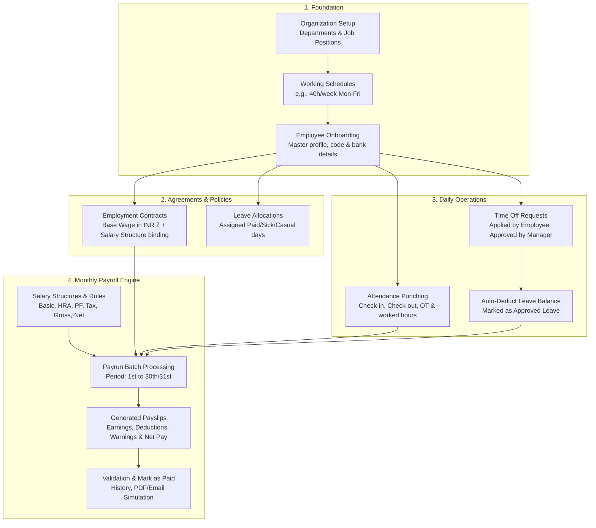

# 🏆 PeoplePay360: Integrated HR & Payroll Operations Platform
### Complete Project Intuition, Module Architecture, and Jury Presentation Guide

---

## 📌 Executive Summary (The 30-Second Elevator Pitch)

> **"PeoplePay360 is an enterprise-grade, integrated HR and Payroll platform designed to eliminate payroll calculation errors, automate attendance-to-payslip pipelines, and enforce strict role-based access control. Rather than relying on disconnected spreadsheets and manual data entry, PeoplePay360 binds working schedules, contracts, attendance punches, and approved leaves directly into a dynamic payroll computation engine — generating compliant, auditable payslips with automatic statutory deduction calculation in seconds."**

---

## 🧭 How the System Works (The Intuitive End-to-End Flow)

Understanding the application lifecycle is simple when you visualize the flow as a connected pipeline:

---

## 🛠️ Technology Stack & Engineering Architecture

| Layer | Technology | Architectural Role |
| :--- | :--- | :--- |
| **Frontend UI** | **Next.js 16 (App Router)** + **React 19** | Ultra-responsive Server & Client Components, deep linking, dynamic route segments. |
| **Styling & Theme** | **Tailwind CSS** + **Lucide Icons** | Premium dark-mode aesthetic, custom tokens, micro-interactions, responsive typography. |
| **Client State & Cache** | **TanStack Query (React Query v5)** | Optimistic UI updates, automated query invalidation, background refetching. |
| **Backend API** | **Node.js** + **Express.js (ES Modules)** | Clean Layered Architecture: `Controller -> Service -> Repository -> Database`. |
| **Database & ORM** | **PostgreSQL** + **Drizzle ORM** | Strictly typed relational schema, foreign key cascades, unique constraints, zero impedance mismatch. |
| **Authentication** | **Dual JWT (Access + Rotating Refresh)** | Cryptographic tokens, 12-round bcrypt password hashing, multi-device DB session tracking. |
| **Caching & Security** | **Redis (with In-Memory Fallback)** | Sliding-window API rate limiting and 60-second caching for high-read organization master data. |
| **Validation** | **Zod Schema Validation** | Runtime validation on all API inputs with descriptive error messages. |

---

## 📦 Module-by-Module Deep Dive

---

### 1. Authentication & Role-Based Access Control (RBAC)

#### What It Does:
Guarantees enterprise security by segregating system privileges across 5 distinct organizational roles:
1. **`ADMIN`**: Full platform governance, system configuration, user provisioning.
2. **`HR_PAYROLL_MANAGER`**: Manages salary structures, payroll batches, employee contracts, and final payslip validation.
3. **`HR_MANAGER`**: Manages employee master directory, departments, job positions, schedules, and attendance corrections.
4. **`HR_PAYROLL_USER`**: Read-only auditing mode for salary structures; operational processing of attendance and leaves.
5. **`EMPLOYEE`**: Self-service access to own profile, check-in/out attendance, leave requests, and personal payslips.

#### Key Features & Under-the-Hood Engineering:
- **Dual-Token Strategy**: Employs short-lived Access Tokens (15m) and secure Refresh Tokens (7d) stored in PostgreSQL sessions.
- **Silent Refresh & Request Replay**: If an access token expires mid-session, [api-client.ts](file:///c:/HR_&_Payroll/Team-646-PeoplePay360_HR_-_Payroll/app/frontend/src/lib/api-client.ts) automatically fetches `/auth/refresh` in the background and transparently replays the original API call with zero user interruption.
- **Session Revocation**: Logging out revokes the session token in the database, immediately invalidating compromised refresh tokens across devices.
- **Rate-Limiting Shield**: Authentication routes are rate-limited (30 requests/15m) to prevent brute-force attacks.

---

### 2. Organization Management (Departments, Job Positions & Schedules)

#### What It Does:
Constructs the core operational backbone of the company before employees are hired.

#### Key Features & Under-the-Hood Engineering:
- **Departments**: Code, name, and operational cost-center description (e.g., `ENG - Engineering`, `SAL - Sales`).
- **Job Positions**: Linked directly to departments, defining roles and salary grading bands.
- **Working Schedules**:
  - Configurable shifts (e.g., 5-day week vs. 6-day week, 8 hours/day).
  - **Auto-Calculated Weekly Hours**: Toggling working days automatically recalculates total hours per week (`hoursPerWeek = workingDays.length * hoursPerDay`), preventing manual human miscalculation.
  - Generates working schedule lines for baseline punch compliance checks.
- **High-Performance Caching**: Organization queries are cached in Redis with instant pattern-based cache invalidation (`cache:org:*`) upon edits.

---

### 3. Employee Master Directory

#### What It Does:
Centralizes workforce records, personal details, company positions, and banking information.

#### Key Features & Under-the-Hood Engineering:
- **Dual Visual Modes**:
  - **Table View**: Sortable columns, search by name/code, pagination, and status filters (`ACTIVE`, `PROBATION`, `ON_LEAVE`, `TERMINATED`).
  - **Kanban Board**: Drag-and-drop grouping by Employment Status, Department, or Contract Type.
- **Comprehensive Onboarding**: Captures official work email, emergency contact, date of joining, department, job role, working schedule, and bank routing/IFSC details.
- **Automatic User Provisioning**: HR can toggle "Create System Account" during employee registration to provision credentials with designated roles immediately.
- **Smart Badge Deep-Linking**:
  - On the employee profile page ([/employees/[id]](file:///c:/HR_&_Payroll/Team-646-PeoplePay360_HR_-_Payroll/app/frontend/src/app/employees/%5Bid%5D/page.tsx)), clickable smart badges dynamically route with filter parameters:
    - `Active Contract` ➡️ Routes to `/contracts?employeeId={id}`
    - `Attendance` ➡️ Routes to `/attendance?employeeId={id}`
    - `Time Off Balance` ➡️ Routes to `/time-off?employeeId={id}`
    - `Payslips` ➡️ Routes to `/payroll?employeeId={id}`

---

### 4. Employment Contracts Management

#### What It Does:
Establishes the legal and financial terms of employment, defining base pay in INR (₹) and binding the employee to a working schedule and salary structure.

#### Key Features & Under-the-Hood Engineering:
- **Unique Contract References**: Automatically generates unique tracking numbers (`CTR-{employeeCode}-{random}`).
- **Relationship Auto-Resolution**: When creating a contract, if the HR manager only selects the employee, the backend automatically looks up the employee's existing department, position, and schedule from their master record.
- **Active Contract Validation**: The payroll computation engine validates that an employee has an active contract covering the payrun date period before computing wages.
- **Currency Standard**: All monetary compensation is cleanly tracked in Indian Rupees (₹) with decimal precision.

---

### 5. Attendance & Punch Operations

#### What It Does:
Tracks daily clock-ins, clock-outs, total worked hours, overtime, and manager corrections.

#### Key Features & Under-the-Hood Engineering:
- **Real-Time Punch Calculation**: When check-in and check-out occur, the backend calculates exact worked hours down to two decimal places:
  $$\text{Worked Hours} = \frac{\text{CheckOut Time} - \text{CheckIn Time}}{3600 \text{ seconds}}$$
- **Overtime Detection**: Any shift exceeding 8 standard hours is automatically categorized into overtime hours.
- **HR Correction Audit Trail**:
  - If an employee forgets to clock out, HR managers can open the **Attendance Correction Modal**.
  - Adjusts timestamps, recalculates hours, and logs the change with an audit reason (`editReason`) and the manager's user ID.
- **Clean 24-Hour Formatting**: Frontend helper functions safely parse and display clean 24-hr timestamps (`09:00 → 18:00`) regardless of date offsets.

---

### 6. Time Off & Leave Management

#### What It Does:
Administers leave policies, annual leave quota allocations, employee requests, and manager approvals.

#### Key Features & Under-the-Hood Engineering:
- **Configurable Time-Off Types**: Supports Paid Annual Leave, Sick Leave, Casual Leave, and Unpaid Leave with custom color codes.
- **Quota Allocation Tracking**: HR allocates balances (e.g., 20 days/year); employees see active balances and days consumed.
- **Self-Service Application**: Employees apply with date ranges and reasons; system auto-computes requested business days.
- **Smart Auto-Deduction**:
  - When submitting a leave request without an explicit allocation ID, the backend automatically locates the employee's active approved allocation.
  - When the manager clicks **Approve**, the system executes `deductTakenUnits`, guaranteeing real-time balance accuracy.
- **Rejection Accountability**: Refusing a leave request prompts for a mandatory refusal reason recorded in the database.

---

### 7. Salary Structures & Dynamic Rules Computation Engine

#### What It Does:
The mathematical core of PeoplePay360. Configures rules and mathematical formulas to determine gross earnings, statutory allowances, and deductions.

#### Key Features & Under-the-Hood Engineering:
- **Hierarchical Rule Categories**:
  - `BASIC` (Base Salary)
  - `ALW` (Allowances: HRA, Transport, Medical)
  - `GROSS` (Gross Earnings total)
  - `DED` (Deductions: Provident Fund, Professional Tax, TDS)
  - `NET` (Final Take-Home Pay)
- **Three Computation Methods**:
  1. **FIXED**: Static rupee amount (e.g., ₹2,500 Special Allowance).
  2. **PERCENTAGE**: Percentage of another rule (e.g., HRA = 40% of BASIC).
  3. **FORMULA / PYTHON EXPRESSION**: Dynamic conditional evaluation (e.g., `BASIC * 0.12 if BASIC > 15000 else 1800`).
- **Sequenced Evaluation Pipeline**: Rules execute in strict sequence order (e.g., Sequence 10: Basic, Sequence 20: HRA, Sequence 50: Gross, Sequence 70: PF, Sequence 100: Net Pay).
- **Role-Based Protection**: `HR_PAYROLL_USER` is restricted to read-only visibility, while Managers can modify formulas.

---

### 8. Payroll Processing & Payrun Batches

#### What It Does:
Executes end-to-end payroll runs for the entire workforce or specific departments in a controlled two-step batch wizard.

#### Key Features & Under-the-Hood Engineering:
- **Two-Step Creation Wizard**:
  - **Step 1 (Scope & Period)**: Select payroll period (e.g., Sep 1 - Sep 30), payment date, target department, and default salary structure.
  - **Step 2 (Workforce Selection)**: Filter active employees with single-click select-all or individual employee checkboxes.
- **High-Speed Computation Engine**:
  - Evaluates each employee's active contract, working schedule, attendance logs, and approved unpaid leaves.
  - Executes the salary structure rule hierarchy.
  - Generates individual payslips with breakdown lines for every earning and deduction.
- **Duplicate & Overlapping Payslip Detection**:
  - Validates that an employee does not already have an existing payslip in the selected period.
  - If a duplicate is detected, it attaches a non-blocking **Validation Warning** to the payslip for manager review.
- **Lifecycle State Machine**:
  $$\text{DRAFT} \longrightarrow \text{COMPUTED} \longrightarrow \text{VALIDATED} \longrightarrow \text{PAID \& CLOSED}$$
- **Disbursement & Delivery**: Includes simulated single-click payslip emailing and bulk distribution to all employees in the batch.

---

### 9. Executive Dashboard & Real-Time KPIs

#### What It Does:
Provides executive visibility over organizational headcount, attendance rates, pending leaves, and monthly payroll expenditure.

#### Key Features & Under-the-Hood Engineering:
- **Real-Time KPI Cards**: Total Workforce, Present Today, Pending Leave Approvals, and Total Monthly Payroll Disbursed in ₹.
- **Dynamic Charting**: Leave type distribution, department breakdown, and attendance trends.
- **Role-Gated Actions**: Action buttons (like "Add Employee" or "New Payrun") are intelligently disabled with explanatory tooltips when accessed by standard employees.

---

## 💡 Top 6 "WOW Factors" to Highlight to the Jury

When presenting PeoplePay360, emphasize these 6 engineering achievements that elevate this project above typical hackathon submissions:

1. **Integrated Cross-Module Pipeline**:
   - *Talk about this*: Attendance punches and leave deductions don't sit in a silo. When a payrun is executed, the computation engine queries attendance and approved leaves directly to calculate accurate pro-rated wages.
2. **Dynamic Salary Formula Engine**:
   - *Talk about this*: Salary rules are not hardcoded. The system supports dynamic percentages (`HRA = 40% of BASIC`) and expressions sequenced in ascending order.
3. **Enterprise Resilience & Transparent Silent Refresh**:
   - *Talk about this*: The frontend automatically recovers from expired access tokens without logging the user out or dropping form inputs, using HTTP-only rotating refresh tokens.
4. **Smart Deep-Linking Navigation**:
   - *Talk about this*: From an employee's profile card, clicking any metric (Contracts, Attendance, Time Off, Payroll) opens that module pre-filtered for that employee with an interactive clearable badge.
5. **Overlapping Payslip & Attendance Duplicate Guardrails**:
   - *Talk about this*: The database and service layers prevent double clock-ins on the same date and flag overlapping payslips with explicit audit warnings.
6. **Production-Ready Dark Aesthetic**:
   - *Talk about this*: Modern, responsive, high-contrast dark theme designed with glassmorphic cards, micro-animations, and status badge indicators.

---

## 🎤 5-Minute Pitch & Demo Script (Follow This Step-by-Step)

| Time | Action on Screen | What to Say to the Jury |
| :---: | :--- | :--- |
| **0:00 - 0:45** | Open **Login Page** ➡️ Sign in as HR Manager | *"Good morning, Jury. In traditional companies, HR and Payroll operate in disconnected silos, leading to delayed payments and calculation errors. We built PeoplePay360 — a unified platform connecting employee schedules, attendance, leaves, and salary structures into a single automated payroll engine."* |
| **0:45 - 1:30** | Navigate to **Dashboard** | *"Here on the Dashboard, executives get instant visibility over total headcount, present employees, pending leave requests, and total monthly payroll cost. Notice our role-based security: buttons and sensitive actions adapt dynamically based on user role."* |
| **1:30 - 2:30** | Go to **Employees** ➡️ Click an Employee Profile | *"In the Employee Directory, we support both Table and Kanban views. If we open an employee profile, look at our Smart Badges. Clicking 'Active Contract' or 'Attendance' immediately deep-links to that module with the employee pre-filtered."* |
| **2:30 - 3:15** | Go to **Attendance** ➡️ Open **Log Entry** / **Correct** | *"Our attendance system logs check-in and check-out times, automatically computing worked hours and overtime. If an employee forgets to clock out, managers can make audited manual corrections with a mandatory reason."* |
| **3:15 - 4:15** | Go to **Payroll** ➡️ Open **Payrun Wizard** | *"Now to the core: batch payroll processing. In Step 1 of our wizard, we select our target period and salary structure. In Step 2, we select our employees. When we click 'Initialize Payrun', our calculation engine evaluates contracts, attendance, allowances, and statutory deductions in real time, detecting any duplicate payslips with validation alerts."* |
| **4:15 - 5:00** | View Generated Payslip ➡️ Click **Validate & Pay** | *"Finally, the manager reviews the itemized breakdown — Basic, HRA, Provident Fund, and Net Take-Home in INR. Once validated, the payrun is marked as Paid and closed. PeoplePay360 turns days of payroll headache into a 30-second automated workflow."* |

---

## ❓ Common Jury Questions & Confident Answers

#### Q1: "How do you handle calculation of salaries if an employee joins mid-month or takes unpaid leave?"
> **Answer**: *"Our payrun service checks the employee's active contract start date and queries all approved leaves categorized as unpaid. If an employee joined mid-month or had unexcused absences, the engine calculates the ratio of billable days to scheduled working days and applies a pro-rata factor against the monthly base wage before executing allowance and deduction rules."*

#### Q2: "What prevents duplicate or fraudulent payroll runs?"
> **Answer**: *"We enforce dual protection: at the API layer, payruns have batch code uniqueness and status lifecycle locks (`DRAFT -> COMPUTED -> VALIDATED -> PAID`). At the computation layer, `findOverlappingPayslips` scans existing records for that employee in the target date range, generating a visible warning alert on the payslip."*

#### Q3: "How is your authentication secured against token theft?"
> **Answer**: *"We use a dual-token mechanism. Short-lived access tokens expire in 15 minutes, while refresh tokens are stored in database sessions with client metadata (IP, user agent). When an access token expires, our custom frontend client performs a silent refresh. If a refresh token is reused or invalidated, the entire session tree can be revoked immediately."*

#### Q4: "Why choose Drizzle ORM over Prisma or raw SQL?"
> **Answer**: *"Drizzle ORM gives us maximum query performance with zero runtime overhead and strict TypeScript type-safety. It allows us to define relational joins and complex aggregations directly against PostgreSQL while guaranteeing that schema changes stay synchronized across the backend."*

---

*Document compiled and verified for PeoplePay360 team presentation.*
